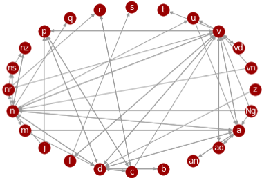
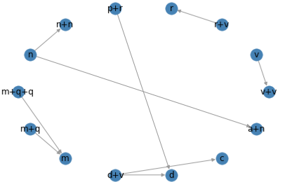

# A-Fine-grained-Evaluation-Set-on-Chinese-POS-Tagging 精细化的中文词性标注评测集

We propose a Fine-grained evaluation system on Chinese POS Tagging. The focus is to determine the evaluation items and the word examples in each item; accordingly, We established an evaluation set with a scale of 5873 sentences covering 2326 word examples and 70 evaluation items.

我们提出了一套精细化的中文词性标注评测体系。我们的工作重点在于确立其中的评测项目以及每个项目所对应的词例，提出了比对、归类、合取的方法；依此，我们初步建立了规模为5873句的、涵盖了2326项词例和70个评测项目的评测试题集。

## 源起
目前，自动词性标注结果的质量低，影响了众多依赖他的下游nlp任务。而词性标注评测体系的难度和效度低，是目前限制其模型进一步改进的主要原因。

对于词性标注，传统的评测体系所关注的评测项目沿袭的是分类器的评测项目，即各类别（各词性）的精确率、召回率和F1分数，评测语料也是以符合语言总体的真实分布为前提，没有作进一步的筛选。因而，目前缺少一种更加语言学导向的精细化评测方法，这种评测方法强调评测项目的精细化和全面化。根据选定的评测项目，可以搜集评测语料，形成最终的评测集。因此，我们引入了一个新的、精细化的、语言学导向的词性标注体系，专门挑出词性具有兼类情况的用例组成评测集，而不会包含没有评测意义的非兼类词，以期为改变现状做出贡献。

## 过程
我们让专家和若干不同的词性标注程序分别对一个适当规模的生语料进行标注，得到由专家标注的结果（视为标准）和由不同的词性标注程序标注的结果。再采用“比对、归类、合取”的方法，初步筛选出值得评测的项目；再对筛选出来的项目按照灵活性和一致性两个原则进行人工筛定，得到最后的评测项目。在本文最终确定的70个评测项目中，共有61个不涉及分词问题，有9个涉及分词问题。根据这70个评测项目及其对应的2326项具体词例，在人民日报语料中收集了规模为5873句的评测试题集。进一步地，根据词例，还可以到开放的真实语料中收集更多的句子，并辅以人工甄别，以此来扩展评测集的“题库”。

## 评测项目概览
在我们最终确定的70个评测项目中，共有61个不涉及分词问题，有9个涉及分词问题。如下图所示。图中的点表示词性，边表示两个词性之间产生了评测项目；边有方向，由标注不足项指向标注过度项；边可以是双向的，每个方向表示一个评测项目。例如，一条从z（状态词）指向d（副词）的边，即表示评测项目`<[z], [d]>`。（各词性标签的详细含义可参考[这里](tags.md)）

<div align="center">


  </div>

## 评测集长什么样？
在我们的评测集中，“#”引导的是一级评测项目，共70个；“##”引导的是词例，即二级评测项目，共2326个；词例下是该词的例句，即具体的评测试题，一般每个词例有1~4个例句。例如：

```
# <['v'], ['u']>
## 等
没等童志成自我介绍完，何大爷像优秀学生背数学公式一样句句准确，“谁都晓得，现在的珠江钢琴名声日隆，你真了不起啊！
且不必说过马路，要左右看，要等，单说上厕所吧，不仅在室内，而且还要坐着大便，这对于我这个“土坷垃”来说，反倒成了障碍。
船舶业不等不靠，不喊不叫，埋头苦干，努力贯彻小平同志的指示，终于在世界市场拓展出生存和发展的空间，用自己的实践走出了一条利用国际市场来发展壮大自己的出口导向型发展道路。
他要求体育界要进一步解放思想，实事求是，大胆探索，勇于创新，克服等、靠、要思想，结合本地区、本部门实际，敢于闯出一条新路。
## 过
本报贵阳１月３日电贵阳市委、市政府通过多种渠道筹集１０００多万元解困金和慰问金，帮助全市３万多困难企业职工及烈军属、老干部过好“两节”。
为了让这些企业职工过好“两节”，市政府帮助其中１０户企业申请了部分贴息贷款。
且不必说过马路，要左右看，要等，单说上厕所吧，不仅在室内，而且还要坐着大便，这对于我这个“土坷垃”来说，反倒成了障碍。
有一位来支队见习的干部过惯了都市生活，来到中队觉得饭菜不可口，便自己买食品吃。
```

评测项目`<['v'], ['u']>`表示：原本是动词词性（'v'），但容易被错标为助词词性（'u'），例如`等`、`过`、`了`等词。

上图的评测项目`<['v'], ['u']>`的第一个词例`等`有四个例句，在这三个例句中，

> “没等董志成自我介绍完...”

> “...过马路要左右看，要等...”

> “船舶业不等不靠，不喊不叫，埋头苦干”

> “...克服等、靠、要思想...”

的`等`都应该是动词，但容易被错标为助词。

## 优势
我们的评测体系将评测项目精细到了具体的“标注结果对应组”，从而可以对评测语料的组织扩展和被测程序的改进产生启发价值。
1. 提高了评测的难度和效度。由于专门挑出词性具有兼类情况的用例组成评测集，并且避开了过于简单的“标注结果对应组”，把评测的焦点放在更加困难的项目上，从而提高了评测的难度、效度。另外，分词问题对词性标注具有重要影响，而传统体系的评测项目不涉及分词问题，本文体系包含了涉及分词问题的评测项目，也提高了评测的效度。
2. 方便评测语料的组织扩展。精细化的评测项目及其词例可以将原本无序的评测语料组织起来，进而启发评测语料依循这些评测项目做扩展。换言之，精细化的评测项目搭好了骨架，向其中填充评测语料就变得方便了。
3. 方便被测程序的改进。能快速定位错误，并针对性地扩充训练语料，或者针对性地引入规则，从而使针对性地改进被测程序成为可能。

## 相关文献
[唐乾桐, 常宝宝, 詹卫东. 精细化的中文词性标注评测集的研制, 2019](http://cips-cl.org/static/anthology/CCL-2019/CCL-19-051.pdf)
